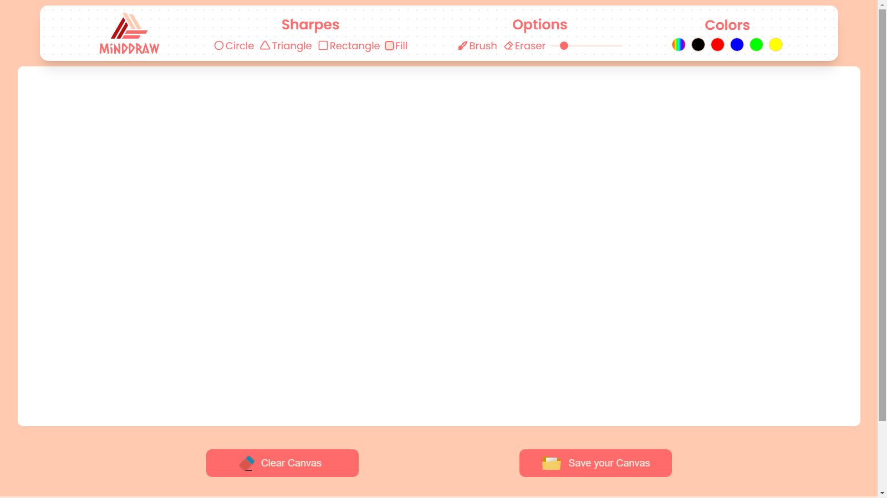

  

---

# minDDraw

minDDraw is a drawing website similar to Microsoft Paint, which allows users to unleash their creativity and create digital works of art. The project provides a user-friendly interface with a toolbar at the top that includes various drawing tools like shapes, colors, and more. It has a canvas where users can draw, and at the bottom there are two buttons: one to completely clear the canvas and one to download the created drawing.

## Features

- Toolbar: The application includes a toolbar at the top, offering various drawing tools such as shapes, colors, and more.
- Canvas where users can create their drawings.
- Clear Canvas: There is a button available to clear the entire canvas and start a new drawing.
- Download Drawing: Users can download their completed drawing as an image file, allowing them to save and share their artwork.
- User-Friendly Interface: The application has an intuitive and user-friendly interface, making it easy for users to navigate and use the drawing tools.

## Technologies Used

- <a href="https://developer.mozilla.org/en-US/docs/Web/HTML" target="_blank">**HTML**</a>: Markup language for creating web pages.
- <a href="https://developer.mozilla.org/en-US/docs/Web/CSS" target="_blank">**CSS**</a>: Styling language for designing the appearance of web pages.
- <a href="https://developer.mozilla.org/en-US/docs/Web/JavaScript" target="_blank">**JavaScript**</a>: Programming language for adding interactivity and dynamic features to web pages.

## Project Structure

- `assets`: This directory contains any necessary assets such as images or icons used in the project.
- `index.html`: The main HTML file that serves as the entry point of the application.
- `styles.css`: The CSS file that contains the styles for the web page.
- `index.js`: The JavaScript file that handles the logic and functionality of the web page.

## Authors

- Matías Gonta

If you have any questions, concerns or interests, feel free to contact me.

---

  

---

# minDDraw

minDDraw es un sitio web de dibujo similar a Microsoft Paint, que permite a los usuarios dar rienda suelta a su creatividad y crear obras de arte digitales. El proyecto proporciona una interfaz fácil de usar con una barra de herramientas en la parte superior que incluye varias herramientas de dibujo como formas, colores y más. Tiene un lienzo donde los usuarios pueden dibujar, y en la parte inferior hay dos botones: uno para borrar completamente el lienzo y otro para descargar el dibujo creado.

## Características

- Barra de herramientas: la aplicación incluye una barra de herramientas en la parte superior que ofrece varias herramientas de dibujo, como formas, colores y más.
- Lienzo donde los usuarios pueden crear sus dibujos.
- Borrar lienzo: hay un botón disponible para borrar todo el lienzo y comenzar un nuevo dibujo.
- Descargar dibujo: los usuarios pueden descargar su dibujo completo como un archivo de imagen, lo que les permite guardar y compartir su obra de arte.
- Interfaz fácil de usar: la aplicación tiene una interfaz intuitiva y fácil de usar, lo que facilita a los usuarios la navegación y el uso de las herramientas de dibujo.

## Tecnologías utilizadas

- <a href="https://developer.mozilla.org/en-US/docs/Web/HTML" target="_blank">**HTML**</a>: Lenguaje de marcado para la creación de páginas web.
- <a href="https://developer.mozilla.org/en-US/docs/Web/CSS" target="_blank">**CSS**</a>: Lenguaje de estilo para diseñar la apariencia de paginas web.
- <a href="https://developer.mozilla.org/en-US/docs/Web/JavaScript" target="_blank">**JavaScript**</a>: Lenguaje de programación para agregar interactividad y características dinámicas a las páginas web.

## Estructura del proyecto

- `assets`: Este directorio contiene todos los activos necesarios, como imágenes o iconos utilizados en el proyecto.
- `index.html`: El archivo HTML principal que sirve como punto de entrada de la aplicación.
- `styles.css`: El archivo CSS que contiene los estilos para la página web.
- `index.js`: El archivo JavaScript que maneja la lógica y la funcionalidad de la página web.

## Autores

-Matias Gonta

Si tiene alguna pregunta, inquietud o interes, no dude en ponerse en contacto conmigo.
